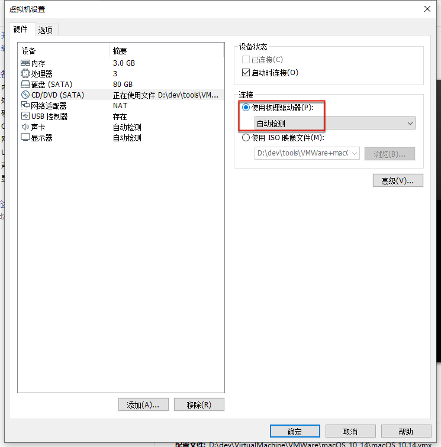

# 安装系统后每次仍进入安装界面

* **现象**：（已安装MacOS系统）但是每次VMWare中启动系统后，仍会进入安装界面，而不是系统的登录界面
* **原因**：启动设备没有切换到硬盘，而是保留了之前的从ISO加载
* **解决办法**：把启动设备改为从硬盘启动
* **步骤**：`虚拟机设置`->`硬件`->`CD/DVD(SATA)`->`连接`：从（之前的安装时采用的）`使用ISO镜像文件`改为`使用物理驱动器`
  * 

