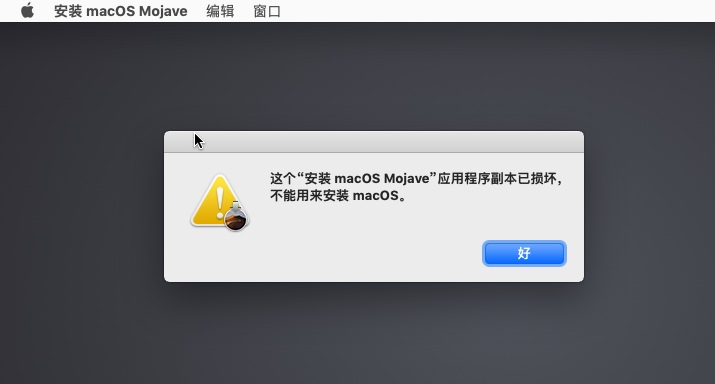
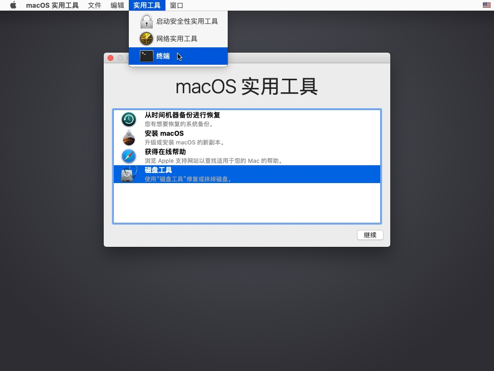
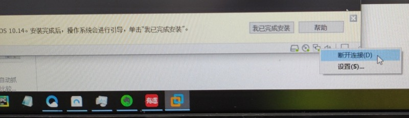
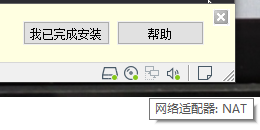
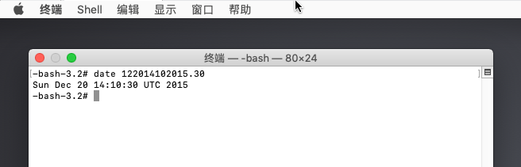
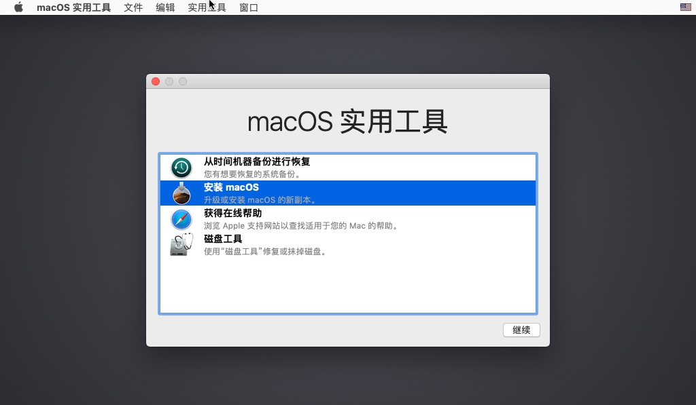

# 这个应用程序副本已损坏，不能用来安装macOS

在VMWare中安装macOS虚拟机期间，如果进入`macOS实用工具`期间，出现弹框报错：

`这个 应用程序副本已损坏，不能用来安装macOS`



* **原因**：镜像的证书过期，并且苹果没有更新证书日期
* **解决办法**：把当前时间改为很久之前，即可规避此问题
* **思路**：打开终端，去设置一个旧的时间
* **步骤**：

点击`好`，回到安装主页面，然后`实用工具`->`终端`：



先去断开此处VMWare中macOS虚拟机的网络：

点击右下角的网络，或者进入设置`断开网络`



即可显示断开：



目的是阻止系统自动更新成当前最新时间

再去终端中输入：

```bash
date 122014102015.30
```



再退出终端，即可继续安装：



