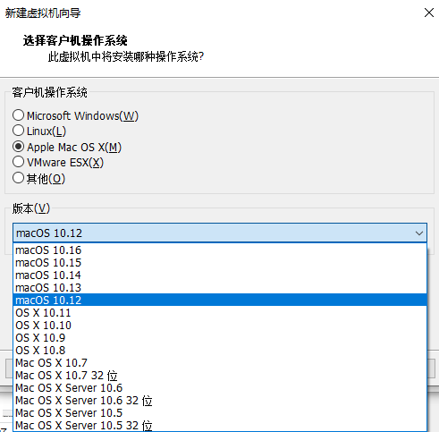

# VMWare新建虚拟机时无macOS选项

如果下载的新版VMWare创建虚拟机期间，没有Apple的macOS选项，则需要找到合适版本的补丁，给VMWare打补丁，使得新建macOS虚拟机时出现Apple的macOS选项：

* 补丁名称：`unlocker`
* 最新版本：`3.0.3`
* 支持最新的：`VMWare 15.6`
  * 注：试了之前的unlocker `3.0`和`3.0.2`，但是无效
    * -> VMWare新建虚拟机没出现macOS选项
* 下载地址
  * [Releases · paolo-projects/unlocker · GitHub](https://github.com/paolo-projects/unlocker/releases)

下载得到：`unlocker 3.0.3`

安装和使用：

经过多次运行`win-install.cmd`

最终：虽然会有其他报错，但是至少VMWare可以新建macOS虚拟机：

* `Apple Mac OS X`
  * `Mac OS X Server 10.5 32位`
  * `Mac OS X Server 10.5`
  * `Mac OS X Server 10.6 32位`
  * `Mac OS X Server 10.6`
  * `Mac OS X 10.7 32位`
  * `Mac OS X 10.7`
  * `OS X 10.8`
  * `OS X 10.9`
  * `OS X 10.10`
  * `OS X 10.11`
  * `macOS 10.12`
  * `macOS 10.13`
  * `macOS 10.14`
  * `macOS 10.15`
  * `macOS 10.16`

注：

* 别的多个教程都提到：运行win-install.cmd之前，要关闭VMWare的进程（和服务）
  * 但是自己注意到：cmd脚本运行期间，会自动尝试关闭VMWare的进程和服务的
    * -> 说明其实无需手动关闭，也是可以（cmd会自动关闭）的。

---

* 细节详见：
  * 【已解决】Win中打了VMWare的unlocker补丁但是VMWare新建看不到Apple Mac OS X选项
  * 【已解决】给VMWare打补丁支持新建MacOS虚拟机
