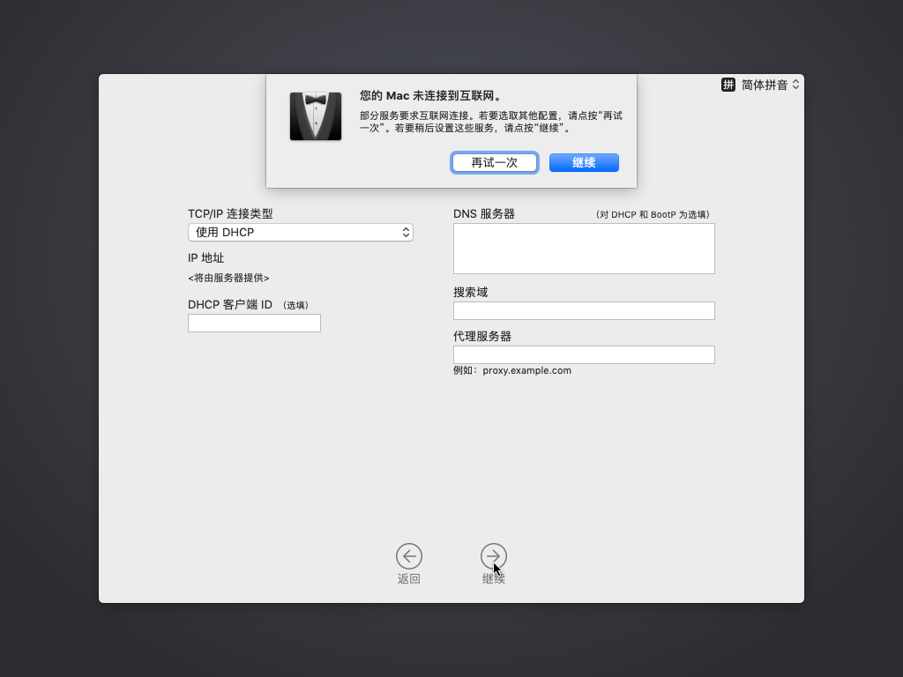
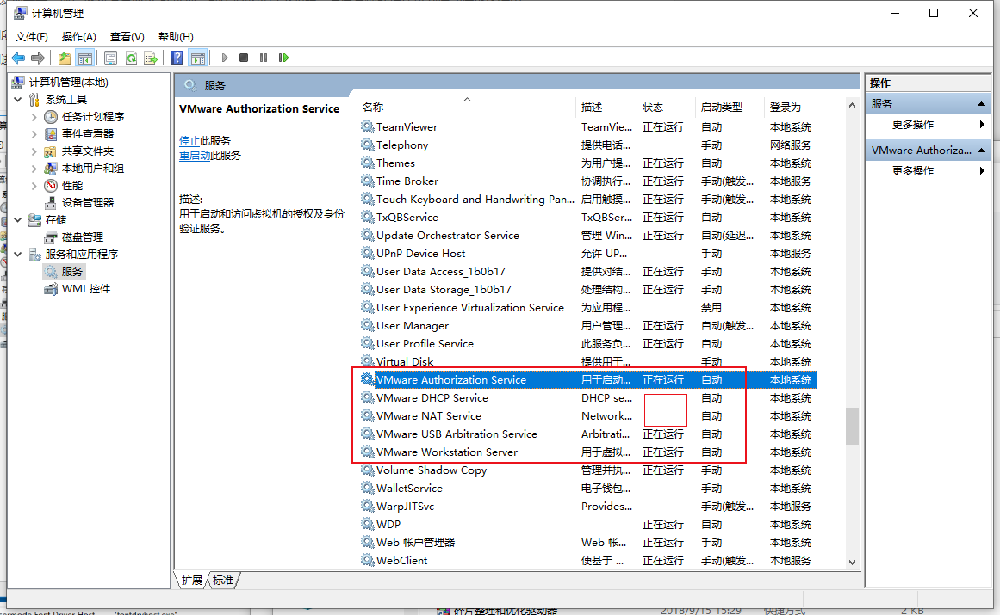
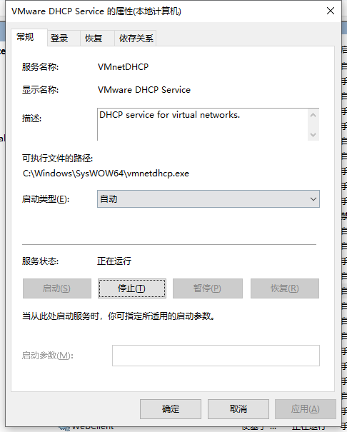
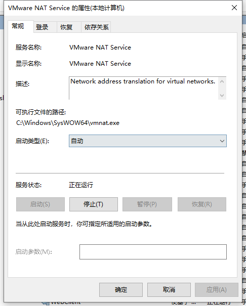
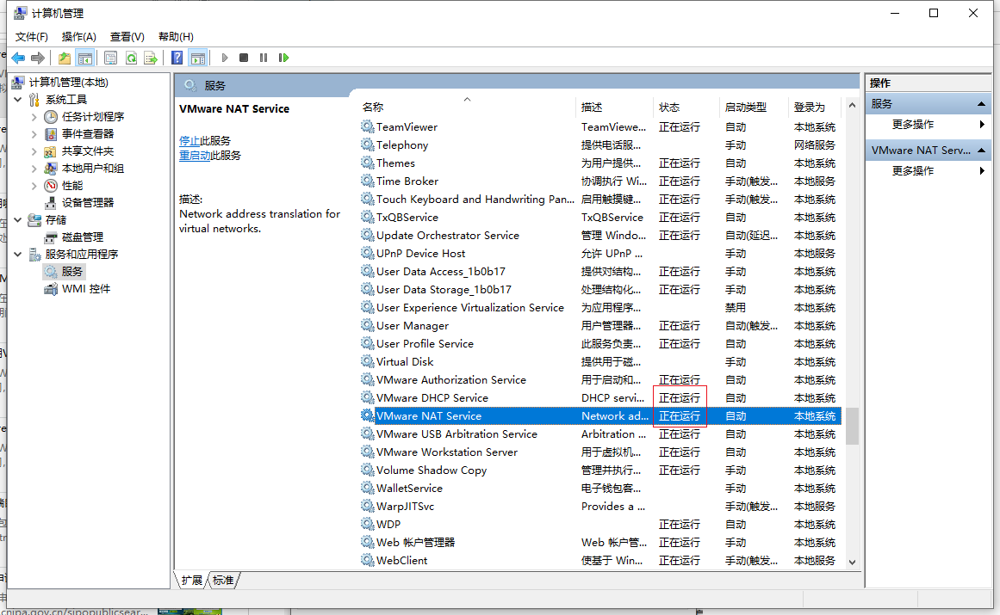

# 您的Mac未连接到互联网

在VMWare安装macOS期间，在网络设置页面，如果点击继续，出现报错：

> 您的Mac未连接到互联网
> 
> 部分服务要求互联网连接。若要选取其他配置，请点按“再试一次”。若要稍后设置这些服务，请点按“继续”

* **原因**：很可能是，此处VMWare的底层负责网络的服务被（无故，或之前用unlocker破解时）关闭掉了
* **解决办法**：重新启动VMWare中关于网络的服务
* **步骤**：

Win10中启动`计算机管理`->`服务`

分别双击其中的：

* VMWare DHCP Service
* VMWare NAT Service

进去后，点击`启动`：

* 
* 

然后就可以看到服务已启动，显示 正在运行 了：

即可解决问题，可以继续安装了。

