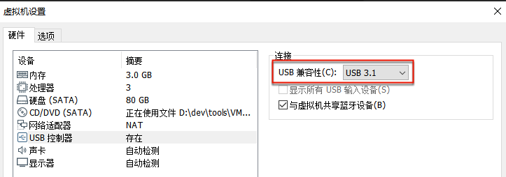
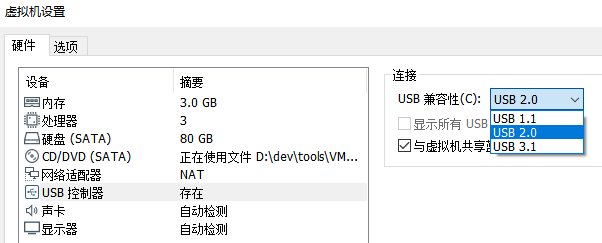
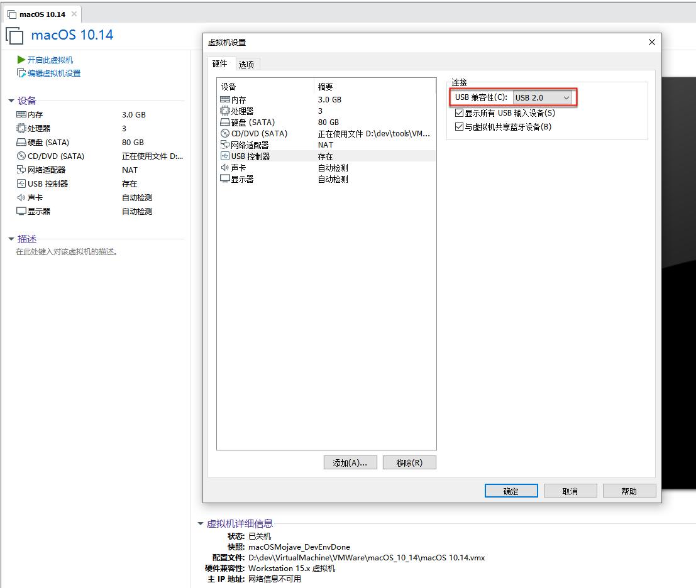
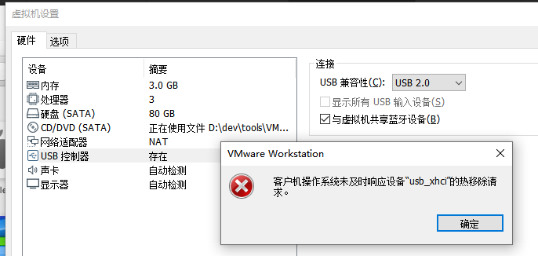
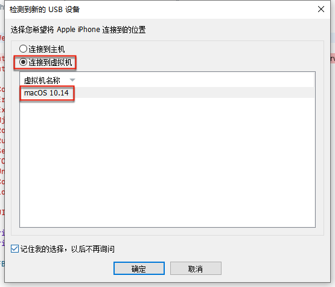
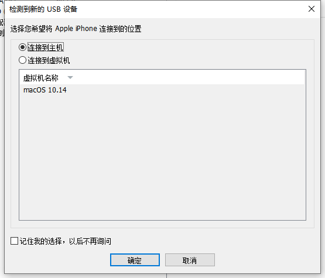
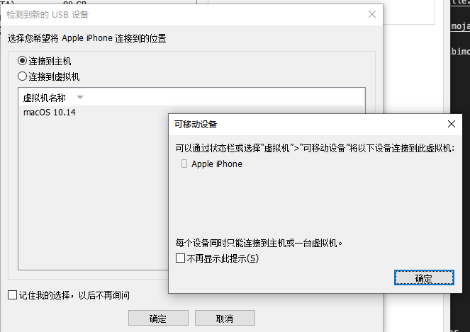
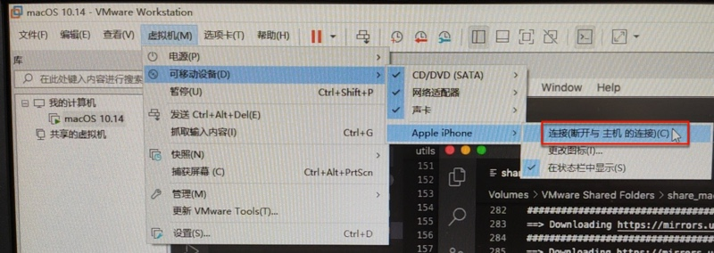
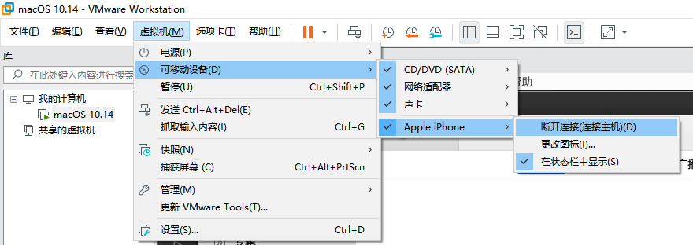

# 无法识别iPhone

虚拟机macOS识别外部主机Win中插入的iPhone

* **背景**：USB控制器 默认：`USB兼容性：USB 3.1`
  * 
* **问题**：会导致虚拟机macOS中无法识别插入的iPhone（Phone7P）
* **解决办法**：改为`USB2.0`
  * 
  * 

## 其他相关

### 客户机操作系统未及时响应设备 usb_xhci的热移除请求

如果出现：`客户机操作系统未及时响应设备 usb_xhci的热移除请求。`

则最好是：关闭虚拟机macOS，再去更改USB设置，即可。

### 插入USB设备后的连接选项

第一次插入iPhone到Win中时，会有弹框，记得选择：

* `连接到虚拟机`
  * 选择当前的虚拟机：`macOS 10.14`

且勾选：`记住我的选择，以后不再询问`，再点击`确定` -> 这样以后每次插入，就不会再有弹框询问了

### 更改USB连接选择

不过，万一不小心选错成默认的：

* `连接到主机`
  * 即当前的host=Windows电脑

则也是可以另外再去更改选项的。且VMWare也很贴心，有对应的提示告诉你后续去哪里改：

即，去 虚拟机-》可移动设备 里去改：

* 虚拟机-》可移动设备-》Apple iPhone -》 连接（断开与主机的连接）
  * 

另外：

如果后续已正常把iPhone连接到了macOS，则此处显示的是：

* `虚拟机-》可移动设备-》Apple iPhone -》 断开连接（连接主机）`
  * 
