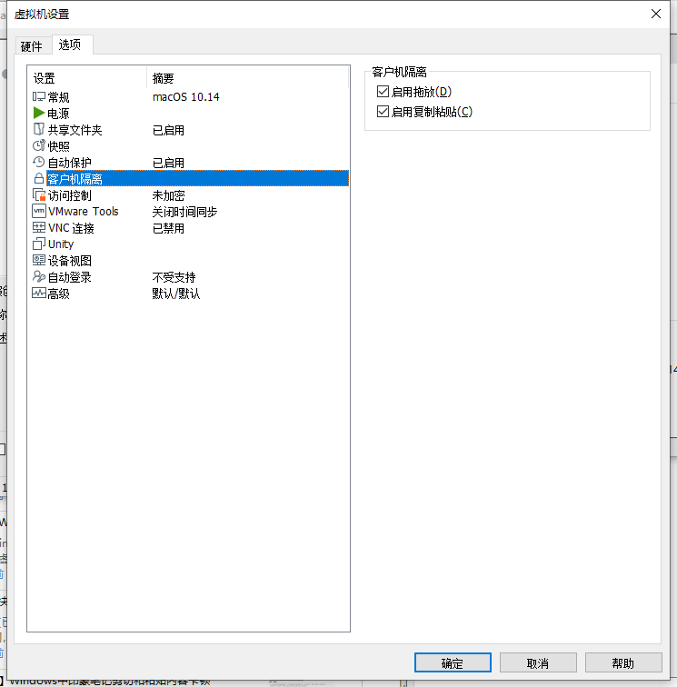
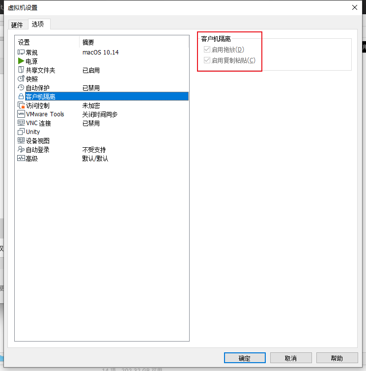

# 共享失效

虽然前面（基本）正常安装了VMWare Tools，即macOS的darwin.iso，当时也 文件拖放复制和共享剪贴板也OK。

但是过了段时间后，就突然失效了：文件（拖放复制）共享 和 剪贴板共享，都失效了。

-》经过多番（尝试不同版本的darwin.iso的）折腾，最终：

即使`kill`掉对应的后台服务`vmware-tools-daemon`，再手动重启该服务：

```bash
sudo "/Library/Application Support/VMware Tools/vmware-tools-daemon" --name vmsvc --common-path "/Library/Application Support/VMware Tools/Plugins/Common" --plugin-path "/Library/Application Support/VMware Tools/Plugins/System" &

"/Library/Application Support/VMware Tools/vmware-tools-daemon" --name vmusr --common-path "/Library/Application Support/VMware Tools/Plugins/Common" --plugin-path "/Library/Application Support/VMware Tools/Plugins/User" &
```

都无法解决 剪贴板共享的问题

-》倒是可以解决：文件夹共享的问题-》可以拖放实现文件复制共享

另外一些细节：

如果VMWare能检测到你已安装了VMWare Tools，且文件拖放和剪贴板共享都正常，则能从设置中看出来：

* 客户机隔离 的 启用拖放 和 启用复制粘贴
  * 都是可以勾选的
    * 
* 如果VMWare Tools失效了
  * 则对应选项都是灰色的，无法勾选的：
    * 

