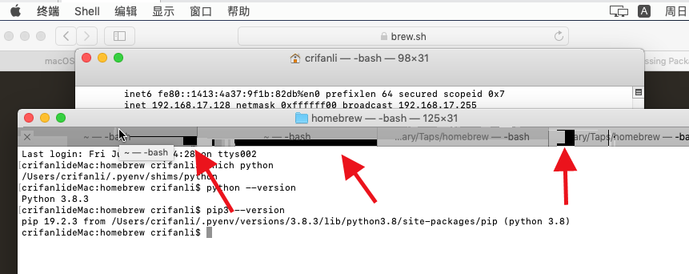
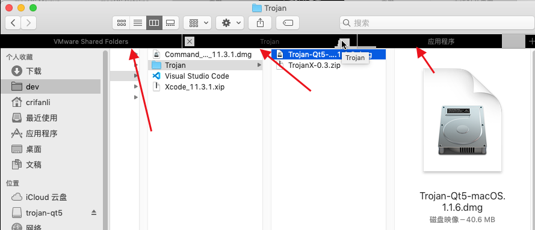
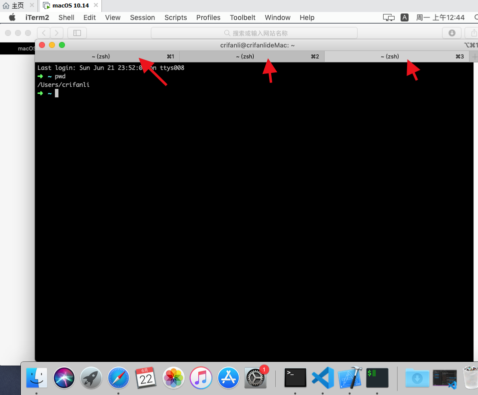

# Tab页黑条状

经过一段时间的使用，发现有个问题：

VMWare中macOS中，自带应用中带tab标签的，都会遇到显示问题：

显示成黑色条看不清tab标题内容，鼠标移动时，偶尔能看清内容

* Terminal终端中的多tab页
  * 
* Safari的多tab页
  * 
* Finder中多tab页
  * 

而第三方应用就没这个问题：

* iTerm的多tab页
  * 

至今不知根本原因，也无法解决。

