# 创建macOS虚拟机

此处介绍在Win中用VMWare创建macOS的虚拟机。

在VMWare的主页，点击加号`➕ 创建新的虚拟机`：

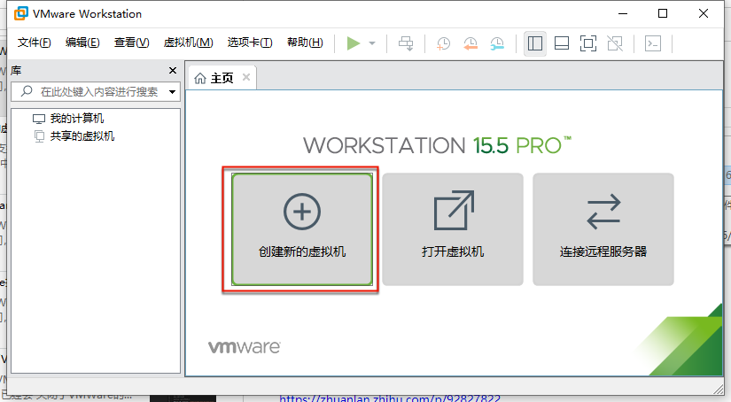

进入： 新建虚拟机向导

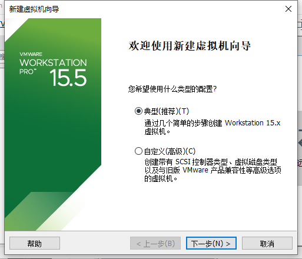

安装客户机操作系统

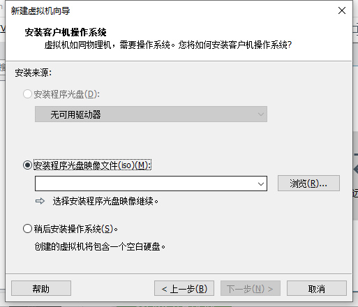

去选择之前的镜像文件：`cdr`或`ISO`

* D:\dev\tools\VMWare+macOS\macOS
  * `MacOS_Mojave_10.14.4_x5(www.w3h5.com推荐下载这个).iso`

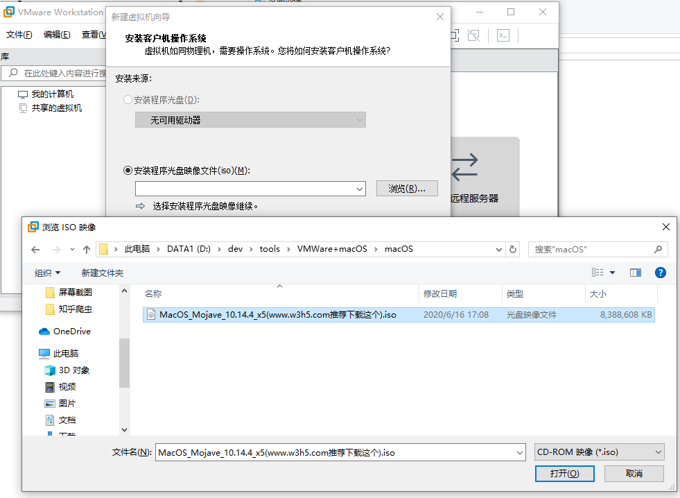

安装程序光盘镜像文件(iso)：

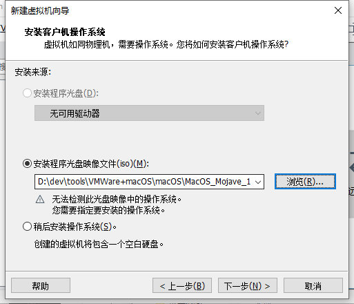

在 选择客户机操作系统 中，选择：`Apple Mac OS X`

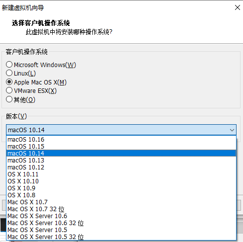

此次选的是，相对版本还算新一点的：`macOS 10.14`

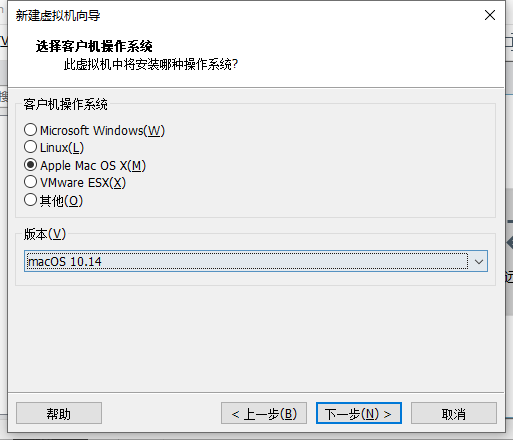

命名虚拟机

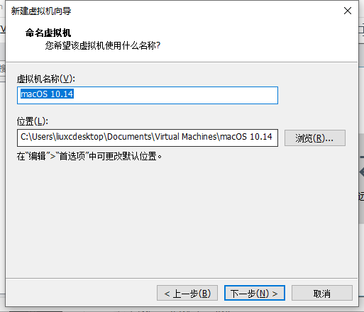

此处默认是：`macOS 10.14`

* 可选
  * 更改保存位置
    * D:\dev\VirtualMachine\VMWare\macOS_10_14
      * 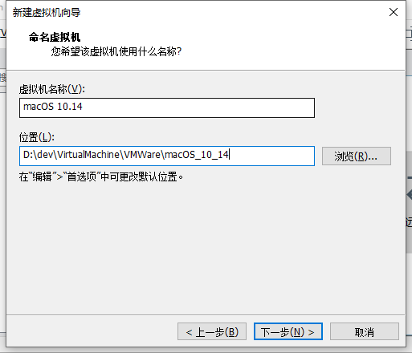

指定磁盘容量

此处默认：`40GB`

* 可选
  * 去把磁盘大小改大一些，比如80G之类的，防止后期不够用
    * 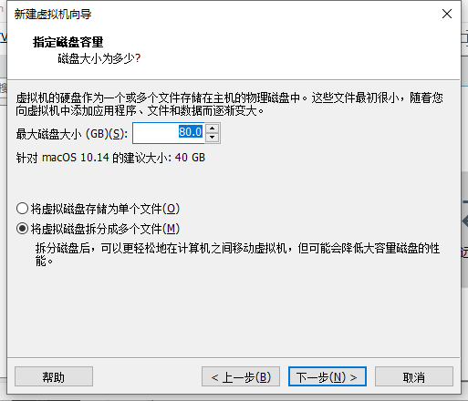

已准备好创建虚拟机

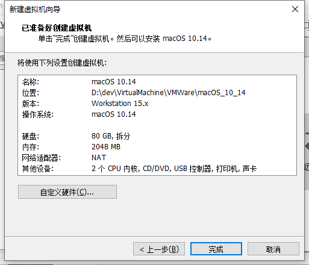

## 自定义硬件

点击 自定义硬件 可以针对自己的情况，调整参数。

其中的要点：

* 内存
  * 如果自己电脑内存很大，可以适当给虚拟机多分配一点
    * 此处自己内存是`8G`，虚拟机内存默认`2G`，后来改为`3G`
      * 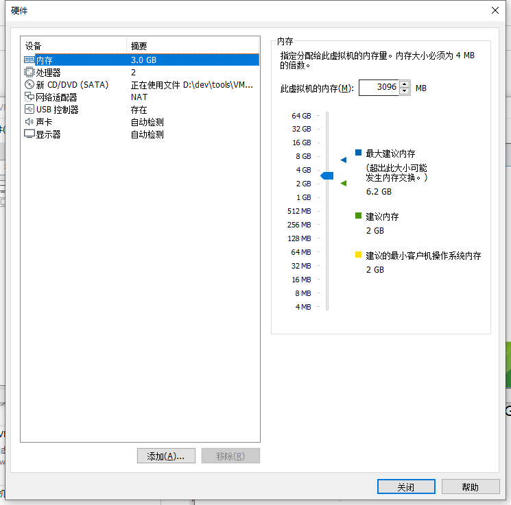
* CPU
  * 此处是：Intel Core i5-9400
    * 最后设置为：
      * 处理器CPU：`1`个
        * 每个CPU：`3`个内核
        * 总共：`3`核
      * 图
        * 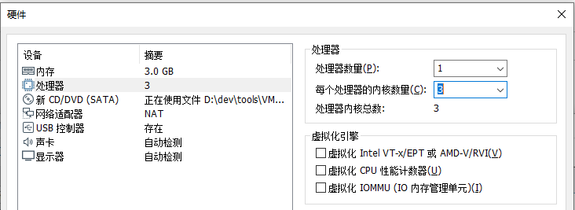
    * 其中 **不要选**：`Intel VT-x/EPT或AMD-V/RVI`
      * 详见：
        * 【已解决】VMWare的虚拟机配置中虚拟化引擎 虚拟化Intel VT-x/EPT或AMD-V/RVI作用和是否应该勾选

* 细节详见：
  * 【已解决】VMWare安装macOS时自定义硬件参数设置

继续，即可创建出来虚拟机：

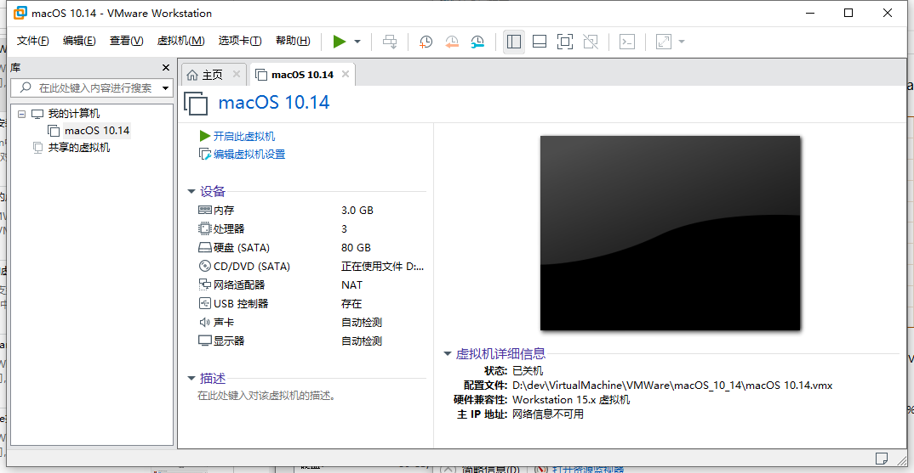

