# Win中安装VMWare

此处介绍，在Windows中，下载和安装Windows版本的VMWare，用于后续安装客户端macOS系统。

## 下载Windows版VMWare

打开VMWare主页：

https://www.vmware.com/go/getworkstation-win

下载：

https://download3.vmware.com/software/wkst/file/VMware-workstation-full-15.5.6-16341506.exe

得到：

* VMware-workstation-full-15.5.6-16341506.exe
  * 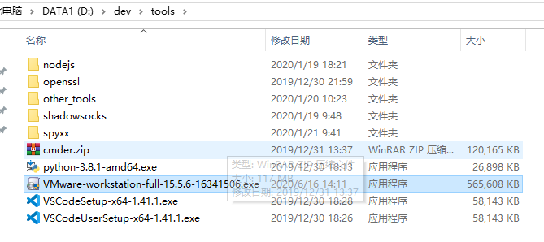

## 安装VMWare

双击去安装

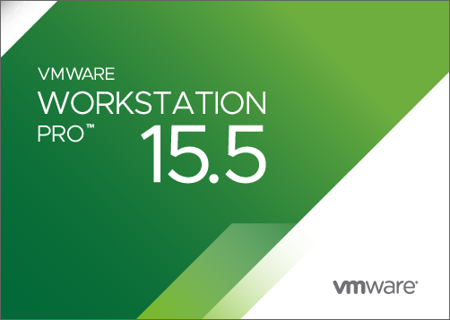

期间会弹框：

* 此安装产品要求您重新启动系统以完成Microsoft VC Redistributable安装，然后重新运行该安装程序
  * 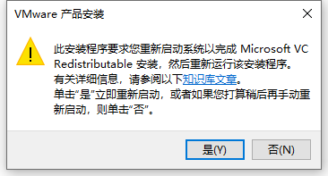

重启后继续安装：

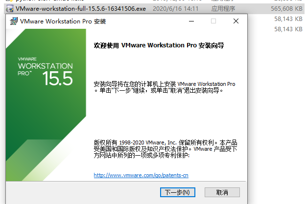

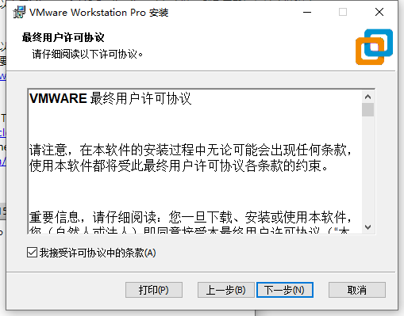

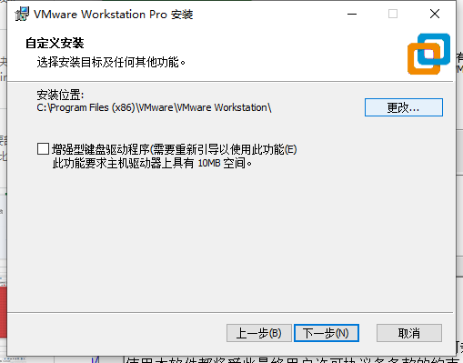

* 可选：自己此处去换到别的目录
  * `D:\dev\DevInstallRoot\VMware\VMware Workstation\`
    * 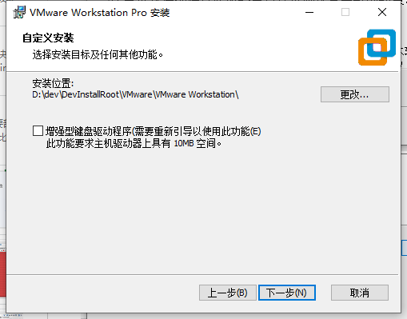

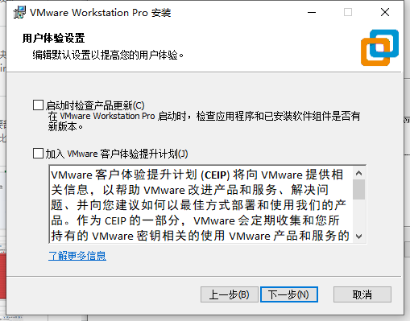

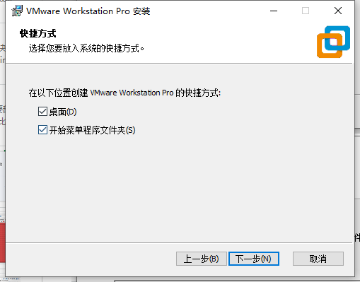

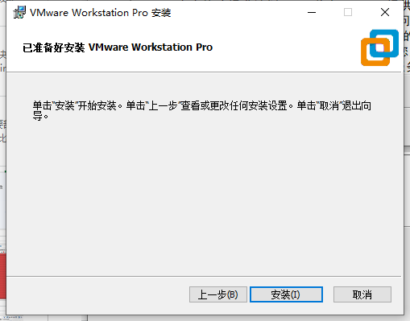

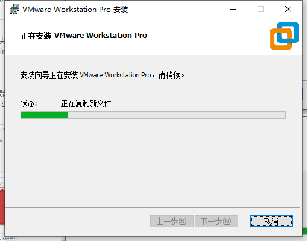

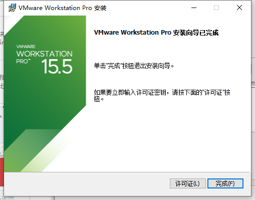

## 注册和激活

点击`许可证`

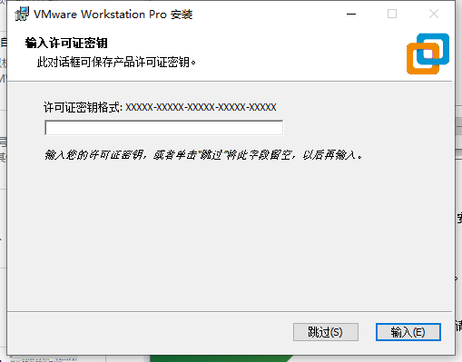

输入网上找的永久激活密钥：

`YG5H2-ANZ0H-M8ERY-TXZZZ-YKRV8`

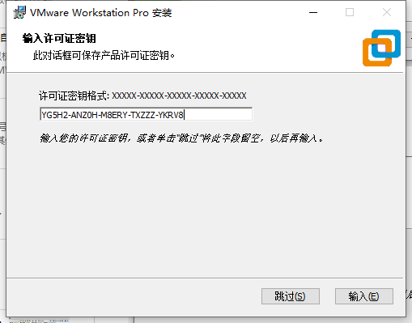

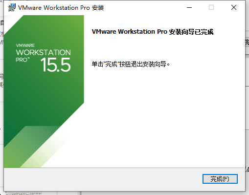

## 打开/启动/运行VMWare

然后从Win10的启动菜单中找到并点击：`VMWare Workstation Pro`

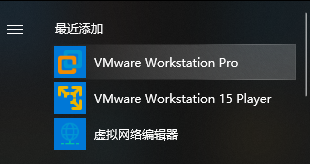

进入VMWare的主页面：

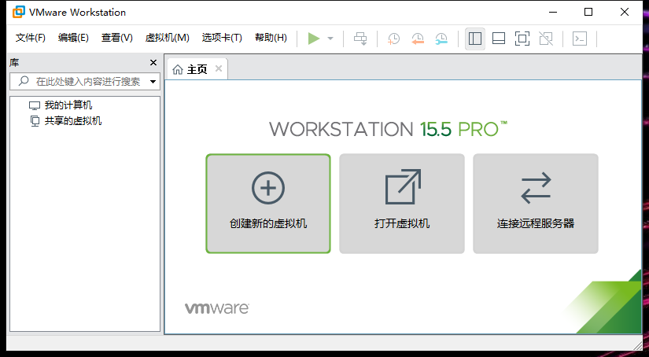

去看看版本号，确认和是否已注册：

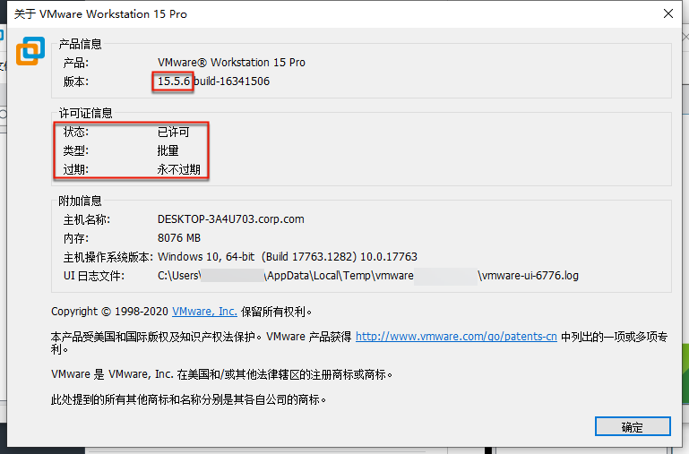

是我们希望的：

* 状态：已许可
* 类型：批量
* 过期：永不过期

### 关闭自动更新

为了防止更新导致破解失效，去关闭更新：

* 取消勾选：`启动时检查产品更新`
  * 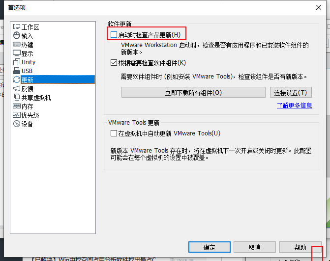

