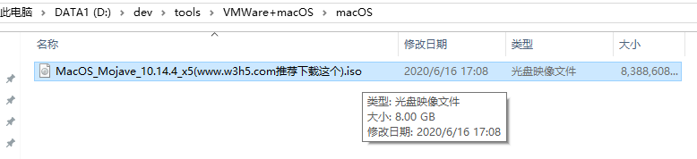

# macOS的安装镜像

此处需求是，在Win10中，通过VMWare，安装`macOS`=`Mac`的虚拟机。

所以安装前要准备：合适的macOS的镜像文件

背景：网上的macOS镜像文件，虽然有一些，但不是所有的都能正常用于VMWare顺利安装的

总体思路：找个可以用于VMWare中安装的macOS的镜像

另外：且`macOS`版本不要太低

* 最新的`macOS`是`10.15`
  * 那最好是最近的几个版本，比如`10.13`、`10.14`等

最后找到了一个：

[VMware虚拟机安装黑苹果MacOS Mojave系统详细教程 - 云+社区 - 腾讯云](https://cloud.tencent.com/developer/article/1537946)

->

[天翼云（满速下载） 黑苹果安装教程：MacOS Mojave 10.14 + Unlocker v3.0](https://cloud.189.cn/t/Fva6vye6VF3m)

访问码：`2182`

注：

* 需要注册并登录[天翼云](https://cloud.189.cn)后才能下载
* 下载速度还是很快的，最快达 `8MB/s`
* 下载其中的：
    * macOS的10.14 Mojave的iso镜像文件
      * `MacOS_Mojave_10.14.4_x5(www.w3h5.com推荐下载这个).iso`
        * 
      * 后记
        * 20210105：现已被河蟹，无法下载
          * 只剩另外一个 `macOS Mojave 10.14 18A391 Lazy Installer.cdr`
            * 不确定是否可用，请自行尝试
    * 和另外的`unlocker`
        * 后续用于给VMWare打补丁
          * ->使得`VMWare`能新建`macOS`的虚拟机

