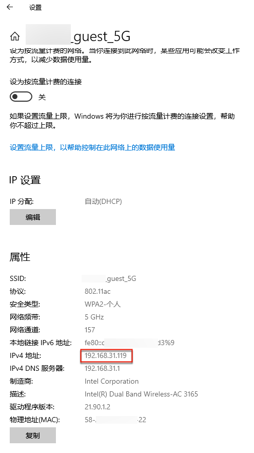
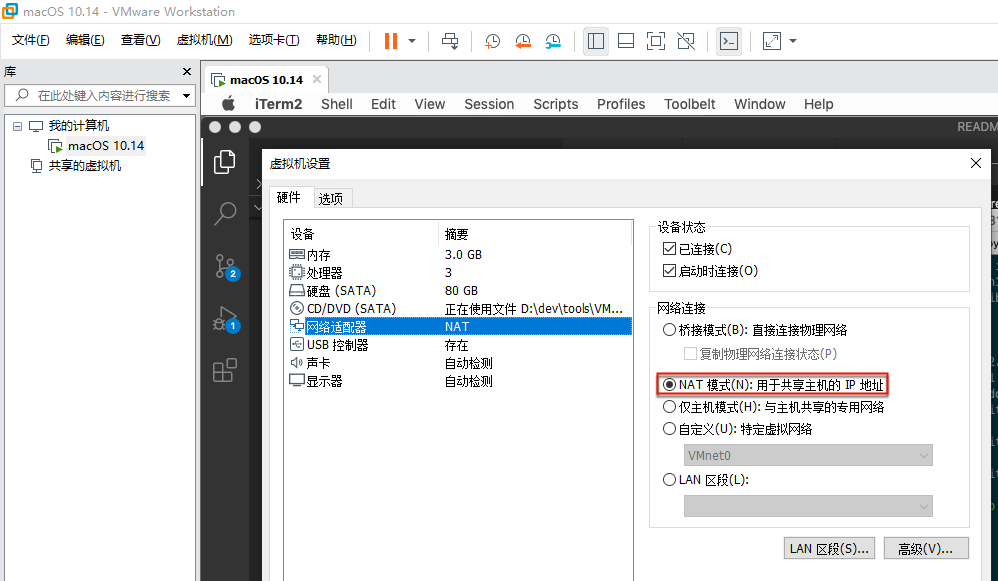
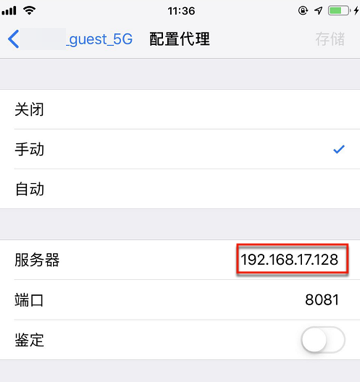
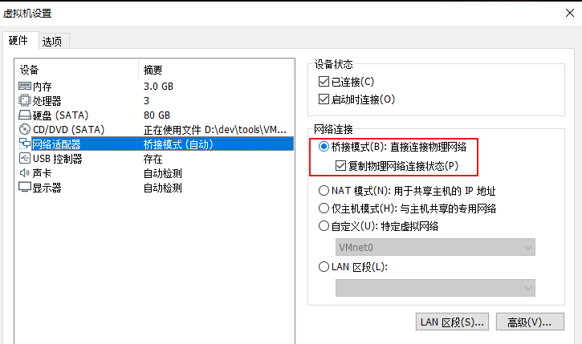
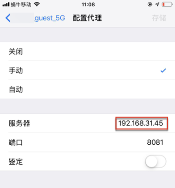

# 访问虚拟机内部服务

虚拟机客户端外部访问虚拟机内部服务

* **背景**

macOS外部，即（和Host的Win，同一个WiFi网络的）iPhone，想要访问macOS中运行的mitmdump代理服务

其中host的win的IP是：`192.68.31.119`



当前VMWare中macOS网络连接模式是默认的：`NAT`



当前macOS的IP地址是：`192.168.17.128`

```bash
crifanli@crifanlideMac  ~  ifconfig | grep 192.168
    inet 192.168.17.128 netmask 0xffffff00 broadcast 192.168.17.255
```

* **现象**

iPhone中 设置了macOS的IP的代理：



但是iPhone中连不上macOS中的代理，无法访问网络。

* **解决办法**

最终此处是：

VMWare设置中把macOS虚拟机的网络从`NAT`改为`桥接`



-> 确保macOS中的IP地址段和Win中一致：

* Win：`19.168.31.119`
* macOS：`192.168.31.45`

然后手机端设置对应Macos的IP的代理：



* **说明**

* 关于如何获取macOS当前的IP地址
  * `ifconfig | grep 192.168`
    * 得知是：`192.168.31.45`

