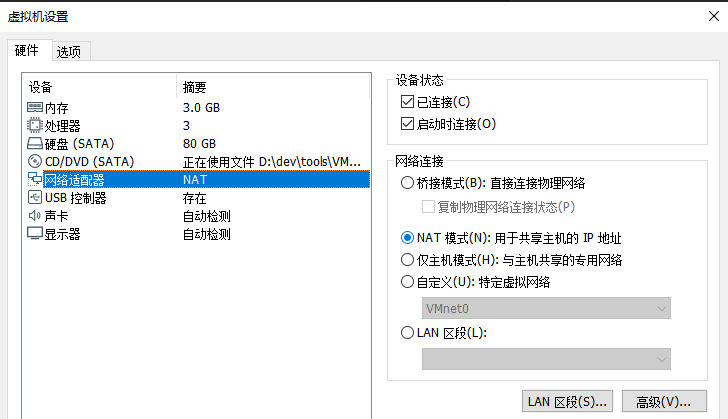

# 网络设置

VMWare中客户端的网络默认设置是：`NAT`



其实对于大多数应用，都已经够用了：

* macOS中可以使用Safari上网
* 虚拟机外部去使用虚拟机内部的服务
  * 比如`mongodb`

## MongoDB的设置

倒是由于MongoDB的配置

`/usr/local/etc/mongod.conf`

中默认的

```bash
net:
  bindIp: 127.0.0.1
```

导致绑定了macOS自己，使得外部无法访问MongoDB。

需要改为：

```bash
net:
  bindIp: 0.0.0.0
```

才能允许外部访问的：

对应的外部host的win中`Robot 3T`中新建连接，加上设置：

* IP：`192.168.17.128`
* 端口：`27017`

即可正常连接client的虚拟机macOS中的MongoDB。
