# 共享文件夹

## 启动共享文件夹

安装了`VMWare Tools`后，再去开启`共享文件夹`

`文件夹共享`默认是关闭的：

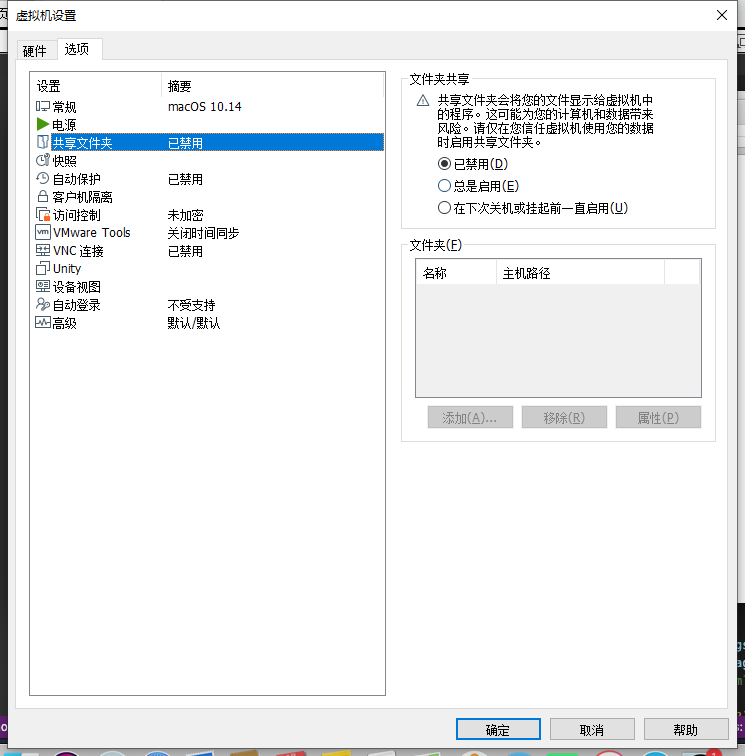

点击：`总是启用`

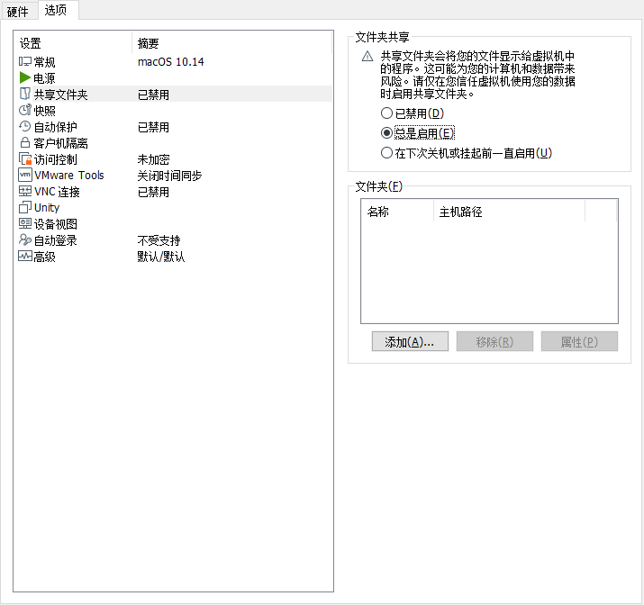

会进入：添加文件夹向导

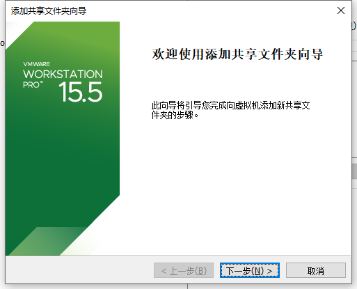

命名共享文件夹：

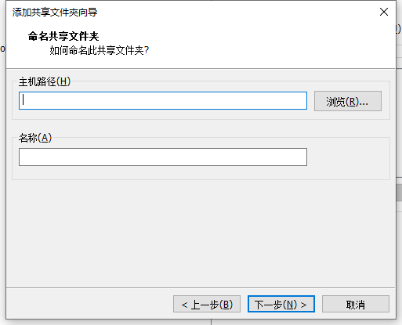

选择一个路径，起个名字，即可：

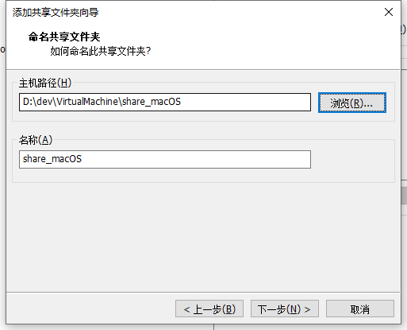

指定共享文件夹属性

此次勾选：`启用此共享`

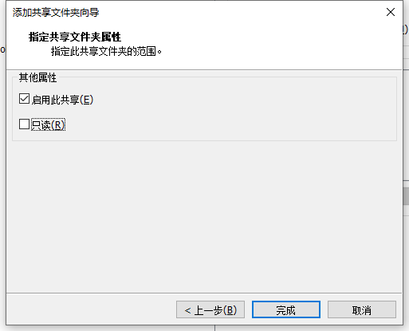

即：

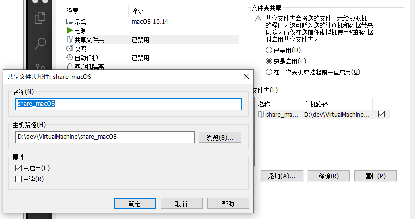

## 去客户端系统找到共享出的文件夹

设置好之后，去客户端操作系统找到对应共享出来的文件夹。

此处的macOS中，找到：`VMware Shared Folders`

`macOS`->`Finder访达`->`前往`->`电脑`->`VMware Shared Folders`

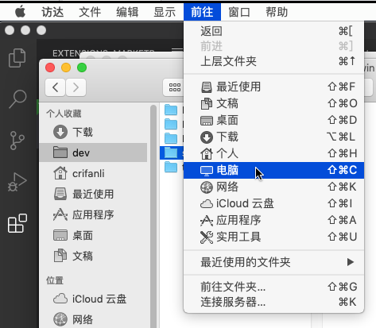

然后是看不到共享文件夹的：

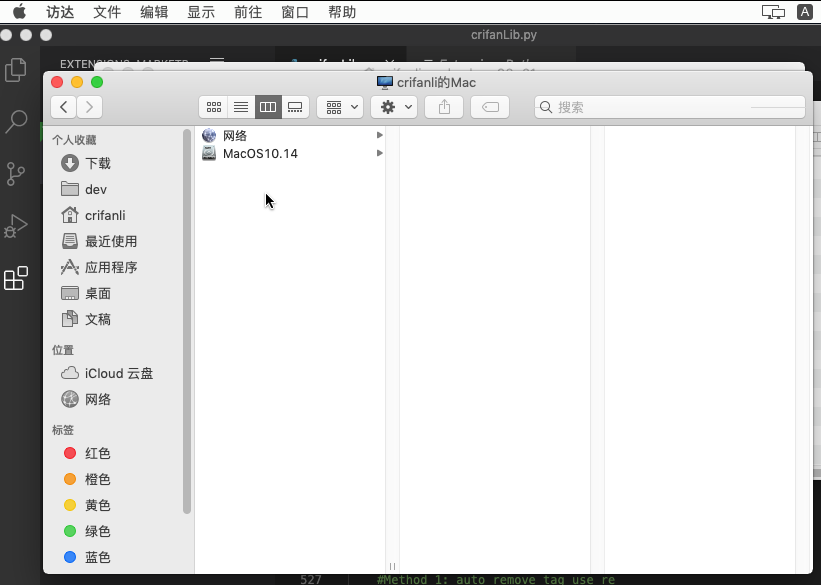

需要重启macOS虚拟机后，才能看到：

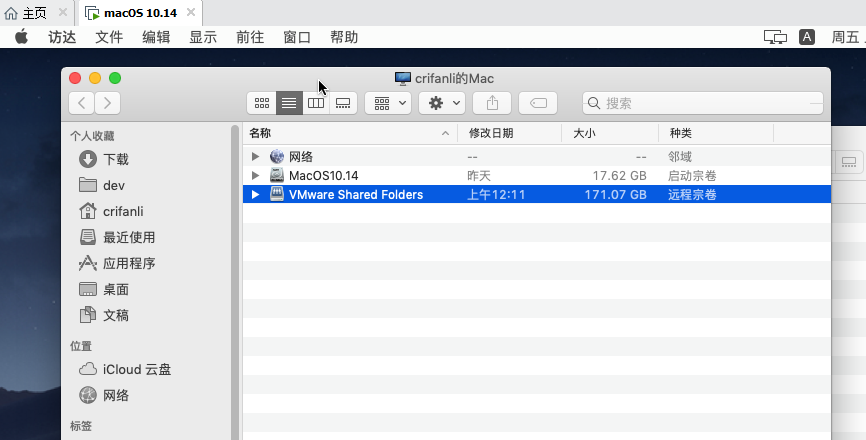

然后去创建文件夹和文件，即可共享：

客户端操作系统macOS中新建文件夹：

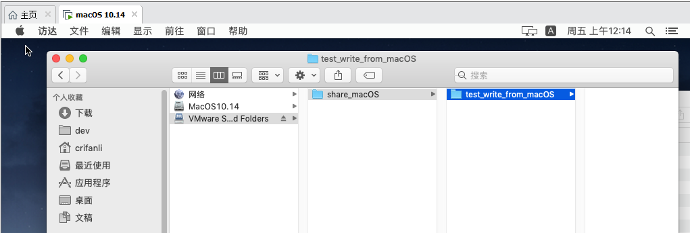

主机host端系统Win中能看到了：

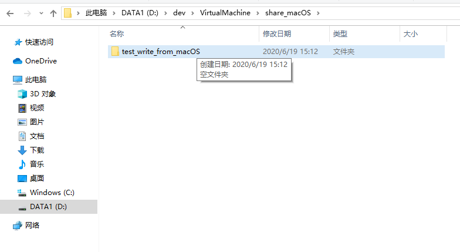
