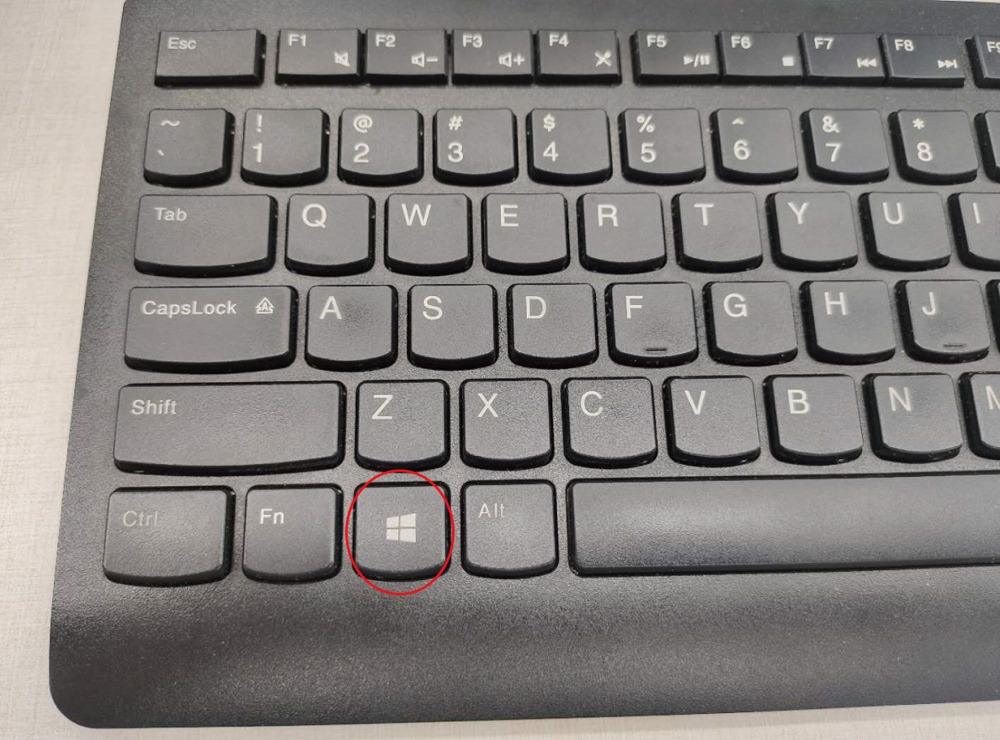

# 快捷键

在Host是Win10中，用VMWare中Client的macOS系统，其中有些快捷键需要注意：

* 核心逻辑是：`Win中Windows键` = `macOS中的Command键`
  * 

所以macOS中的快捷键：

* `复制`=`Command+C` -> `Win+C`
* `粘贴`=`Command+V` -> `Win+V`
* `剪切`=`Command+C`后再`Command+Alt+V` -> `Win+C`后再`Win+Alt+V`
* `切换tab页`= ``Command+` `` -> ``Win+` ``
* `删除键`=`Command+Backspace` -> `Win+Backspace`

