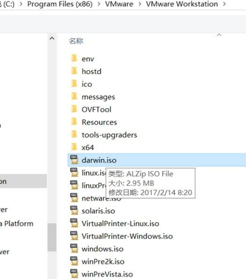
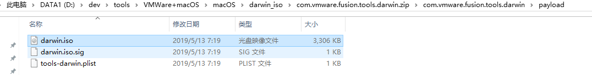

# darwin.iso

`VMWare`针对`macOS`中的`VMWare Tools`，对应的文件就是：`darwin.iso`

针对**不同版本的VMWare**+**不同版本的macOS**，往往不容易找到合适版本的`darwin.iso`。

此处总结一下这方面的心得：

* 旧版本VMWare中，自带对应的darwin.iso的
  * 比如：
    * 
* 而新版本中，已经没了
  * 我此处用了最新版的`VMWare 15.6`，就找不到对应的`macOS`的`VMWare Tools`，即`darwin.iso`
    * 导致只能选用之前版本的darwin.iso
      * 且还要注意
        * 和当前macOS版本相匹配，不能太旧，否则各种问题：
            * 要么无法安装
            * 要么安装后屏幕显示异常（分辨率有问题）
            * 要么证书过期

## `macOS 10.14`即`Mojave`匹配的`darwin.iso`

比如，此处`macOS`是`10.14`（也叫做：`Mojave`）

要去找和`macOS 10.14`即`Mojave`匹配的`darwin.iso`

* 此处我已上传到网盘：
  * `macOS_Mojave_darwin.iso`
    * 链接: https://pan.baidu.com/s/1qxn8kdNfZ5LoTdTG1tfVhA 提取码: b8gs
* 而不能用太旧的不匹配的版本
  * 比如
    * `macOS 10.13`的`darwin.iso`
      * 否则就会各种问题

## 其他旧版本

比如，网上找到了其他的旧版本：

* `VMWare 11.1.0`
  * http://softwareupdate.vmware.com/cds/vmw-desktop/fusion/11.1.0/13668589/packages/com.vmware.fusion.tools.darwin.zip.tar
    * 下载得到压缩包：`com.vmware.fusion.tools.darwin.zip`
    * 解压后得到的：`com.vmware.fusion.tools.darwin.zip\com.vmware.fusion.tools.darwin\payload\darwin.iso`
      * 
* 另外还有个`darwinPre15`
  * http://softwareupdate.vmware.com/cds/vmw-desktop/fusion/11.1.0/13668589/packages/com.vmware.fusion.tools.darwinPre15.zip.tar
    * 其中：
      * `pre15`：表示`previous version before 15`=`老版本`的意思
  * 所以不适用此处新版本，可忽略，不用下载
    * 如果你需要可以下载试试

