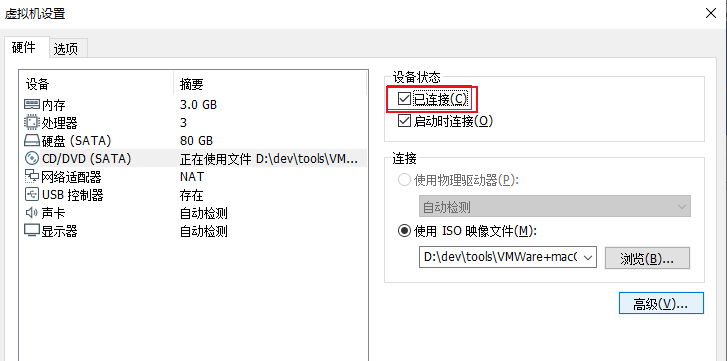
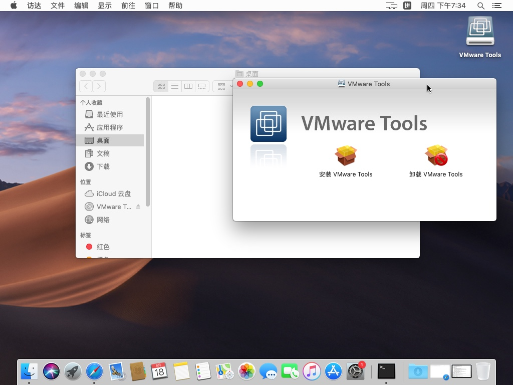
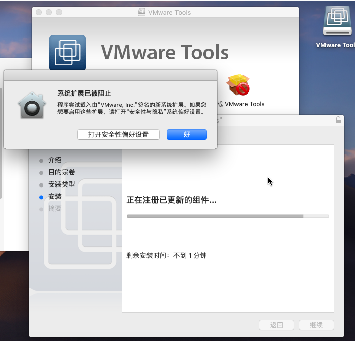
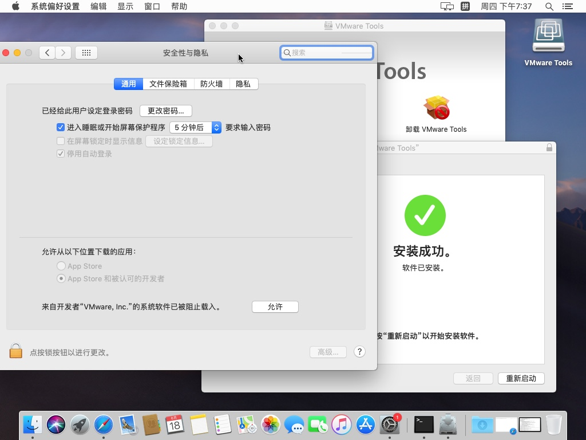
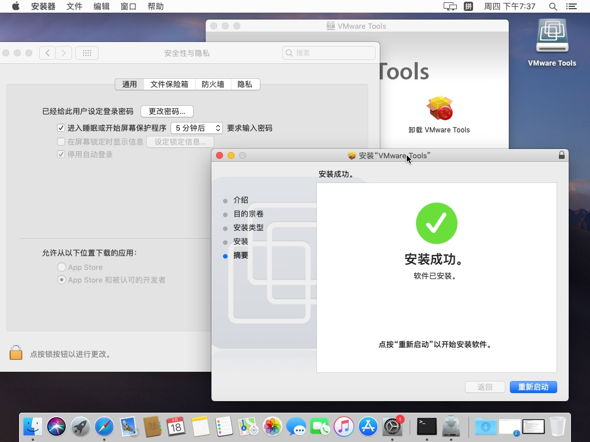

# 安装macOS的VMWare Tools

macOS的`VMWare Tools`，对应文件一般是：`darwin.iso`

此处介绍`darwin.iso`的安装方法

此处给VMWare的虚拟机macOS中安装darwin.iso的VMWare Tools的思路很简单：

让macOS能识别到此处ISO镜像，即可加载和安装。

有2种方式能被识别到：

* 物理上：主机Win中制作darwin.iso成U盘，插上Win，让macOS识别
* 虚拟光驱：虚拟机设置-》CD/DVD(SATA)-》连接-》使用ISO镜像文件-》选择刚才的 darwin.iso
  * 注意：要记得勾选`已连接`
    * 

macOS中识别到此`darwin.iso`后，会弹框安装：

双击`安装VMWare Tools`，然后一路继续安装即可。

其中需要输入macOS的账号和密码。

以及安装末尾会被系统阻止：

需要进入`设置`->`安全性与隐私`->`通用`->`允许从以下位置下载的应用`

会看到`来自开发者VMWare，Inc.的系统软件已被阻止载入`，点击`允许`：

再输入管理员密码，即可成功安装：

