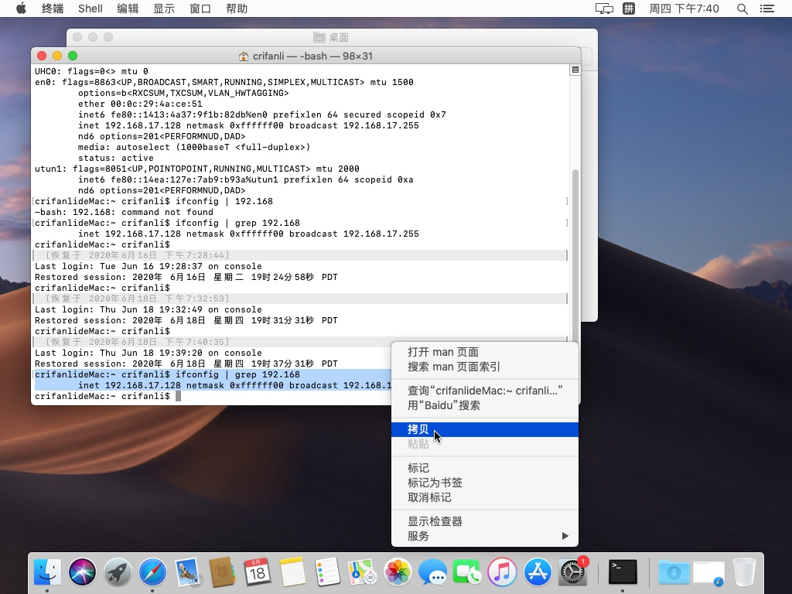
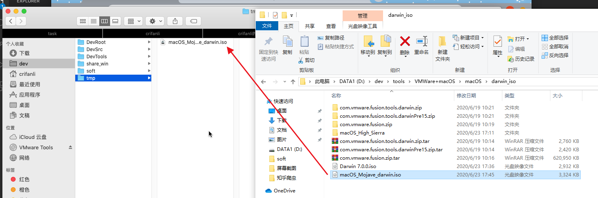
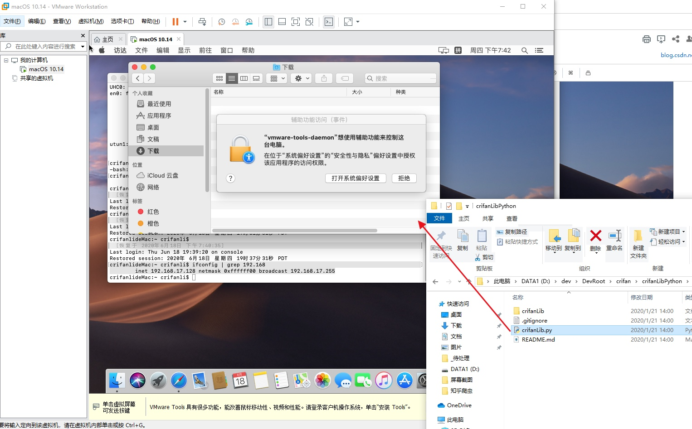
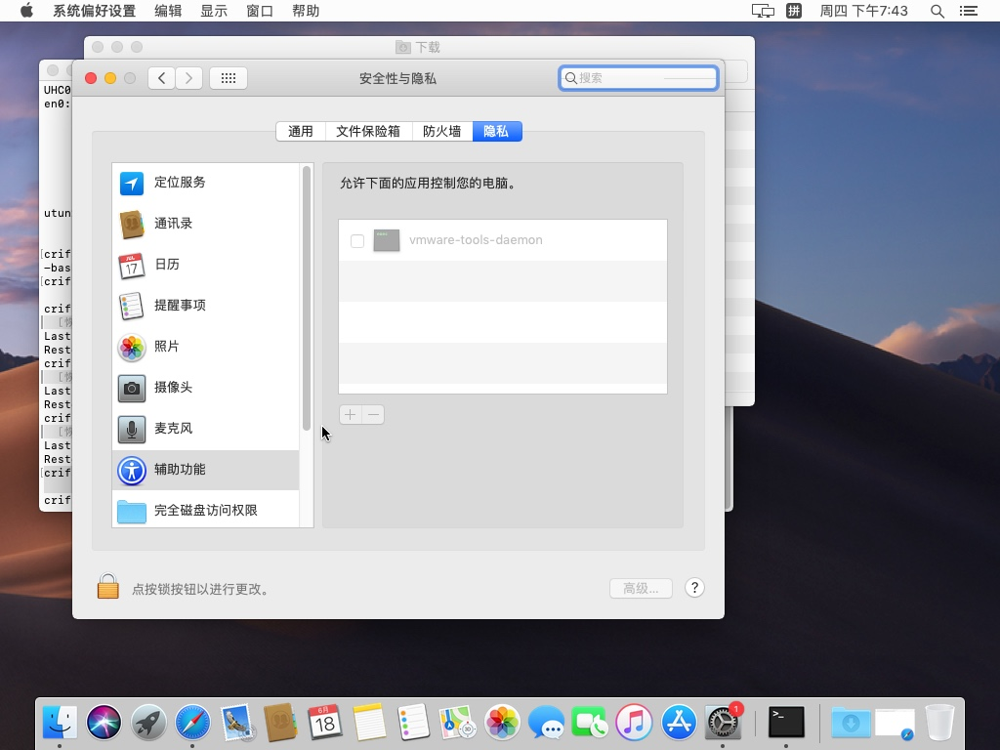
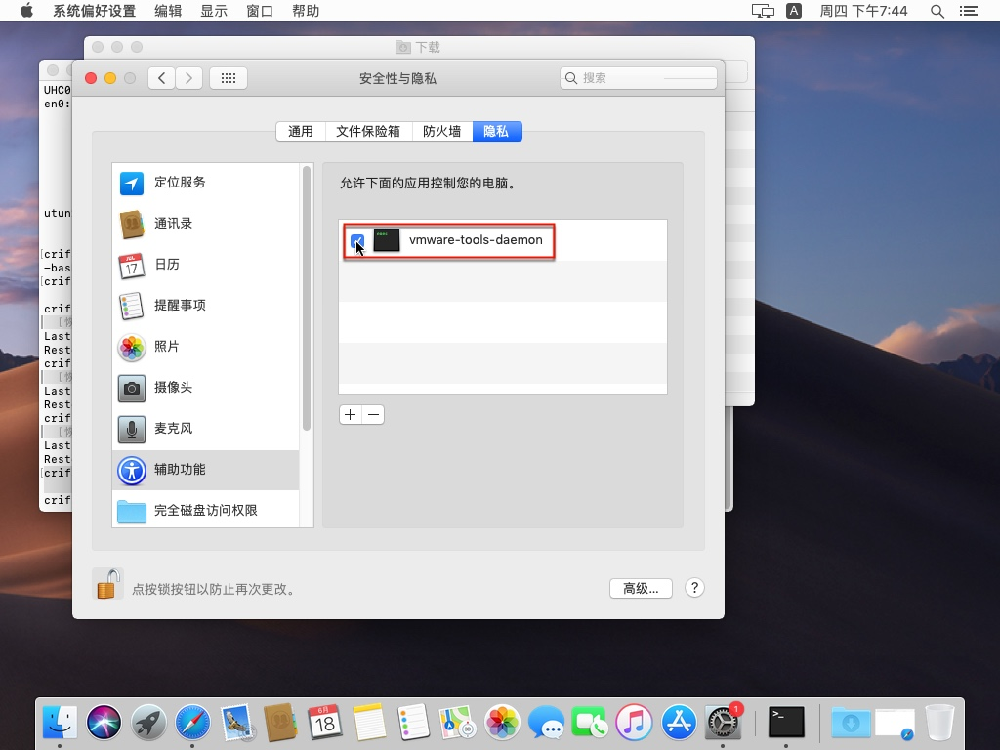

# 安装后所支持的功能

此处介绍`macOS`的`VMWare Tools`=`darwin.iso`安装后的效果，即支持了哪些功能：

## 剪贴板共享

剪贴板共享是有用的：

比如从虚拟机客户端macOS中复制了内容

是可以粘贴到主机Windows中的。

## 拖放复制文件

以及通过拖放实现复制文件也是支持的：

注：

首次拖放文件，会触发`vmware-tools-deamon`的进程授权弹框：

去设置中给与权限即可：

去 `设置`->`安全与隐私`->`隐私`->`辅助功能`：

点击勾选：`vmware-tools-deamon`

